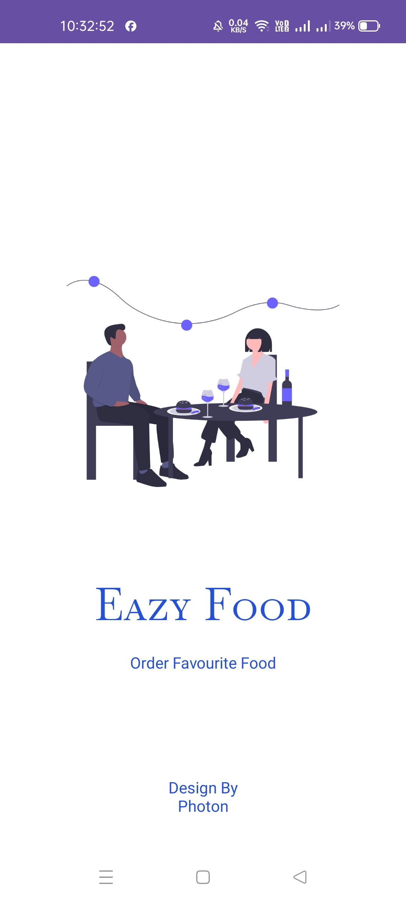

# EAZY FOOD

## Introduction

Welcome to EAZY FOOD! This application helps you discover and order delicious meals from various restaurants around you. Browse menus, customize your orders, and get your food delivered to your doorstep.

## Features

1. Google Authentication for secure login
2. Search for dishes by name or category
3. Add items to the cart and customize orders
4. View order history
5. Profile management
6. Realtime database for live updates
7. User-friendly and responsive design

## Usage

1. Open the app on your Android device.
2. Sign in using your Google account.
3. Add items to your cart and customize them as needed.
4. Place your order.
5. View your order history and manage your profile.

## Screenshots

|  |  |  |  |  |  | |  |  |  |  | 

## Technologies Used

- Kotlin
- Android SDK
- Retrofit
- Room Database
- Firebase Realtime Database
- Google Authentication
- RecyclerView
- Material Design

## Contributing

Contributions are welcome! Please follow these steps to contribute:

1. **Fork the repository**
2. Create a new branch (`git checkout -b feature/your-feature`).
3. Make your changes.
4. Commit your changes (`git commit -m 'Add some feature'`).
5. Push to the branch (`git push origin feature/your-feature`).
6. Open a pull request.

## Contact

For any inquiries, please contact:

- Your Name - [email2felixfelix@gmail.com](mailto:email2felixfelix@gmail.com)
- GitHub: [AnandY4d4v](https://github.com/AnandY4d4v)
